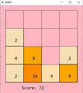
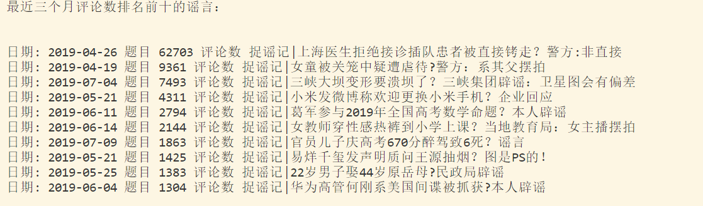

 
## 大一夏小学期总结
### (一) 学习总结
#### 1. 以C语言和JS的形式做小游戏 

##### (1) C语言实现游戏开发     
以贪吃蛇游戏为例，作为Windows程序开发设计的样例，在这次程序设计中：      
***关键要点 :***
- 使用了**mvc模型**，即分为数据模型，视图和控制分离（ps:以后在编写大型程序时常用到该模型）
- Windows应用程序开发过程中的主要工作就是使用API
- 开发大型程序时，用google查文档常见且必要
-  封装思想：将数据隔离不被直接访问，只通过接口来访问，方便数据的修改和完善
        
***Windows程序编程特点 :***   
- windows数据类型： Windows在C语言的基础上定义的,包括句柄
- API函数：Windows给应用程序调用一系列功能的接口函数，如：WinMain Windows,应用程序的入口函数；callback 回调函数
- 窗口&&窗口类：使用GDI绘制图形，进行映射到DC上等一系列操作
  
***我的小游戏 :***     

做了一个简易版的2048，借鉴贪吃蛇源代码及相关文档，一共有三个文件，两个头文件和一个源文件
- game_operation.h是游戏操作的相关函数，包括获取空位置的数量和判断游戏输赢的函数
- square_operation.h是对小方块操作的相关函数，包括小方块上下左右移动的函数
- main.cpp是游戏操作的主要文件，main文件中定义的函数及功能：  
  1.WinMain函数注册窗口类    
  2.WinProc函数调用消息回调函数实现绘制窗口，按键回应。    
  3.GamePaint函数绘制窗口（粉色界面，4*4的方格）   
  4.add_rand_num函数在随机位置生成随机数并在该区域涂色，同时判断游戏输赢   
  5.Paint函数标注每个方格上面的数字   
  6.Paintall函数表示不同数字对应不同颜色的方格  
  7.Done函数判断游戏是否结束  

  
##### (2) JS实现游戏开发

通过JS实现游戏开发，老师同样以贪吃蛇为例进行讲解，用canvas画布，style标签定义CSS样式表，键盘监听等功能
#### 2. 用python进行爬虫实战
以爬票房为例

***关键要点 :***

- 以chromedriver驱动和xpath结合，解析html
- xpath的基本语法规则
- 对数据的整理，将爬到的数据放到列表里，进行打包和排序，最后输出结果      
  
***我的作业 :***   

按评论数总结出近三个月的十大谣言，打印日期，题目和评论数
- init_web_dirver函数驱动chromedriver，close_web_driver取消驱动
- get_data函数是主函数，其中的功能有：   
  1.动态网页的滚轮模拟，通过判断初始时间和当前时间，共翻动页面30次  
  2.用find_elements_by_xpath获取元素定位：时间，题目和评论数  
  3.取出.text内容放入列表中，对三个列表进行打包，再用sorted排序 

2048图片：

爬虫图片：

